# T-Mon: Traces Monitor in xAPI-SG

[](https://mybinder.org/v2/gh/e-ucm/t-mon/conectado?filepath=Conectado.ipynb)


## Table of Contents

  * **[Introduction](#introduction)**
  * **[Usage](#usage)**
    * **[1. Select your mode](#1-select-your-mode)**
    * **[2. Select xAPI-SG traces file](#2-select-xapi-sg-traces-file)**
    * **[3. Run the analysis](#3-run-the-analysis)**
  * **[SIMVA](#simva)**
  * **[xAPI-SG](#xapi-sg)**
  * **[Default visualizations](#default-visualizations)**

## Introduction

**T-Mon: Traces Monitor in xAPI-SG**

**T-Mon** is a set of Jupyter Notebooks to process data in the **xAPI-SG** data format. 
T-Mon loads [xAPI-SG](https://github.com/e-ucm/rage-analytics/wiki/xAPI-SG-Profile) statements (traces), analyzes them, and displays a default set of visualizations that provide a quick overview of its contents.

## Usage

### 1. Select your mode

The main Jupyter Notebook of T-Mon is **[T-Mon.ipynb](https://nbviewer.jupyter.org/github/e-ucm/t-mon/blob/master/T-Mon.ipynb)**. In the first line of the notebook:

* set `local = True` if you are hosting your own Jupyter server locally.
* set `local = False` to work with a web-hosted Jupyter server.

Keep `storage = file`. You can execute the xAPI-SG Processor and interact with it online using [Binder](https://mybinder.org/v2/gh/e-ucm/t-mon/master?filepath=T-Mon.ipynb).

### 2. Select xAPI-SG traces file

When running the **[T-Mon.ipynb](https://nbviewer.jupyter.org/github/e-ucm/t-mon/blob/master/T-Mon.ipynb)** notebook, you will see a widget file selector. 

* If using local mode, the selector will allow you to navigate in your local directory. JSON files will be highlighted in green.


* If using remote mode, you will be able to upload your data file. 


In any case, choose your JSON file containing a list of xAPI-SG statements.

### 3. Run the analysis

Finally, run the analysis.
 
After selected, all xAPI-SG statements in your JSON file will be processed (the Jupyter Notebook [ProcessxAPISGStatement.ipynb](https://nbviewer.jupyter.org/github/e-ucm/t-mon/blob/master/ProcessxAPISGStatement.ipynb) processes each xAPI-SG statement). 

With the information extracted from the statements, the default set of visualizations will be displayed in different tabs in the notebook. See below for details about the visualizations included.

## SIMVA


The xAPI-SG Processor can also connect with **[SIMVA](https://github.com/e-ucm/simva-infra)** to analyze the traces stored there as part of experiments.

To connect with SIMVA and analyze the xAPI-SG traces files stored there:

1. Previous requirements:
  * Download the tar.gz file of the [ipyauth release with KeyCloak support](https://github.com/e-ucm/ipyauth/releases/download/0.2.6-eucm.2/ipyauth-0.2.6-eucm.2.tar.gz)
  * Install ipyauth:
  ```
  pip install ipyauth.tar.gz
  jupyter nbextension enable --py --sys-prefix ipyauth.ipyauth_widget
  jupyter serverextension enable --py --sys-prefix ipyauth.ipyauth_callback
  ```
   * Install other dependencies required by the Notebook ([boto3](https://pypi.org/project/boto3/) and [jwt](https://pypi.org/project/jwt/)):
  ```
  pip install boto3 jwt
  ```
  
2. The main Jupyter Notebook to use is **[T-Mon-SIMVA.ipynb](https://nbviewer.jupyter.org/github/e-ucm/t-mon/blob/master/T-Mon-SIMVA.ipynb)**.  
1. Run the first cell in the notebook. A "Sign in" button will appear in the output. 
1. Click the "Sign in" button, it will pop up a window when you need to enter your **SIMVA credentials**. 
1. Once you have signed in, run the following cells. Keep `storage = simva`, so you will be able to access all traces JSON files available in your SIMVA account.
1. Select your activity id and the `traces.json` file.
1. Run the analysis.

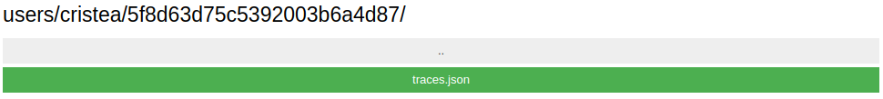

## xAPI-SG

The **Experience API Profile for Serious Games (xAPI-SG)** is a validated xAPI Profile to collect information from serious games. 
Each xAPI-SG statement (trace) represents an activity in the context of a serious game.

For more information about the xAPI-SG Profile, you may visit:
* The **official [Profile repository](https://github.com/e-ucm/xapi-seriousgames)**
* Our [GitHub wiki page](https://github.com/e-ucm/rage-analytics/wiki/xAPI-SG-Profile)
* The [journal publication](https://pubman.e-ucm.es/drafts/e-UCM_draft_297.pdf) about the xAPI-SG Profile.

To generate random xAPI-SG data, you may also try our [xAPI-SG data generator](https://github.com/e-ucm/xapi-sg-data-generator).

## Default visualizations

The Jupyter Notebooks with the default set of visualizations are included in the folder */vis*. 

We currently provide **default visualizations** (see below for description and examples) with the following information:

1. [Games started and completed](#xapisg-gamesstartedcompleted)
1. [Progress of players](#xapisg-playersprogress)
1. [Videos seen and skipped](#xapisg-videosseenskipped)
1. [Progress in completables](#xapisg-completablesprogress)
1. [Progress changes in completables](#xapisg-completablesprogressincreasedecrease)
1. [Scores in completables](#xapisg-completablesscores)
1. [Times in completables](#xapisg-completablestimes)
1. [Correct and incorrect choices per player](#xapisg-correctincorrectplayer)
1. [Correct and incorrect choices in questions](#xapisg-correctincorrectquestion)
1. [Alternatives selected in questions](#xapisg-alternativesselectedquestion)
1. [Interactions with items](#xapisg-itemsinteracted)
1. [Interactions and actions with items](#xapisg-itemsactiontypeinteracted)
1. [Accessibles accessed](#xapisg-accessedaccessible)
1. [Selections in menus](#xapisg-menusselected)

### xAPISG-GamesStartedCompleted

Displays a pie chart of games started and completed.

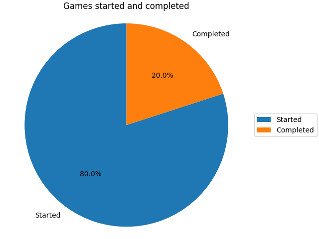

### xAPISG-PlayersProgress

Displays a line chart showing progress over time for each player.

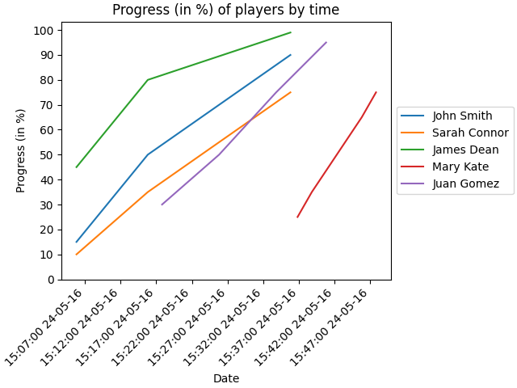

### xAPISG-VideosSeenSkipped

Displays a bar chart showing, for each video, the total number of times it has been seen and skipped.

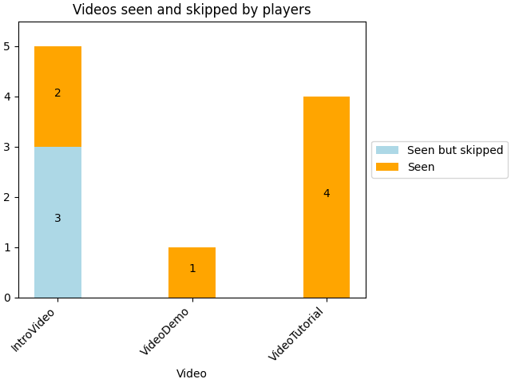

### xAPISG-CompletablesProgress

Displays a bar chart showing, for each player, the progress achieved in the different completables of the game -- as well as in the total game.

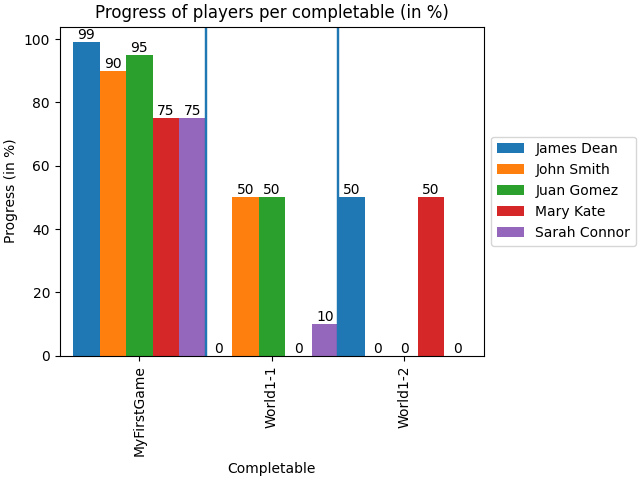

### xAPISG-CompletablesProgressIncreaseDecrease

Displays a points/line chart showing, for each player, the progress along time: increase or decrease of different completables of the game.

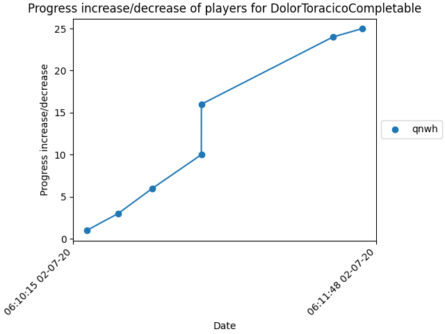

### xAPISG-CompletablesScores

Displays a bar chart showing the score achieved by players in the different completables.

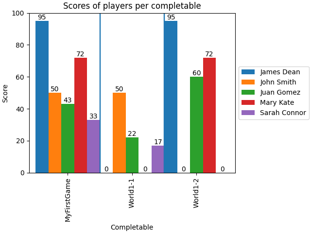

### xAPISG-CompletablesTimes

Displays a bar chart showing, for each completable, the maximum and minimum time of completion by players.

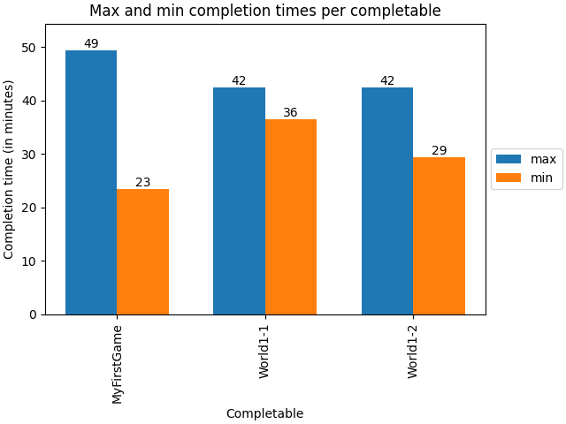

### xAPISG-CorrectIncorrectPlayer

Displays a bar chart showing, for each user the number of correct and incorrect alternatives selected in multiple-choice questions.

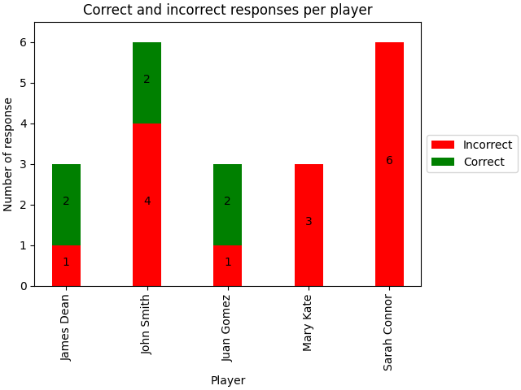

### xAPISG-CorrectIncorrectQuestion

Displays a bar chart with the total number of correct and incorrect alternatives selected by players in each multiple-choice question.

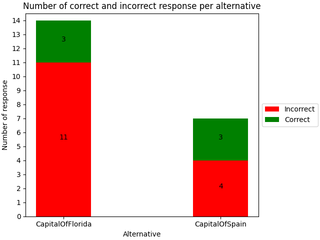

### xAPISG-AlternativesSelectedQuestion

Displays multiple bar charts showing the alternatives selected in each multiple-choice question.

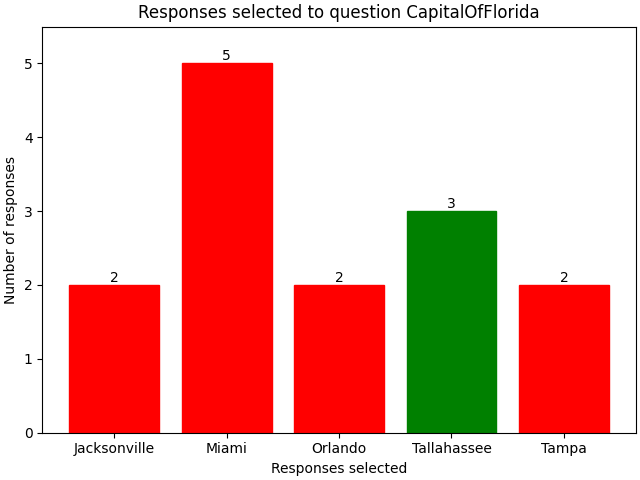

### xAPISG-ItemsInteracted

For each item, a bar-chart displaying, for that item, the number of times that each player interacted with it.

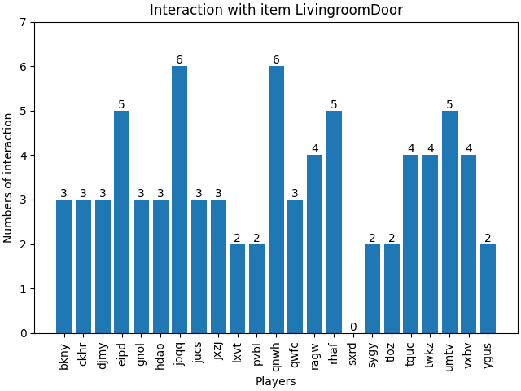

A heatmap showing how many times each player interacted with each item.

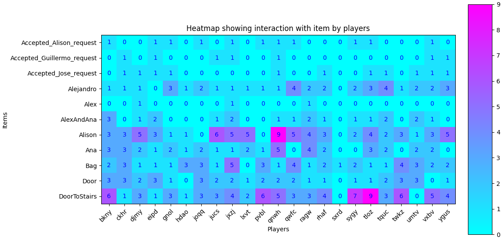

Also, a bubble chart displaying item interactions as a function of time. Larger bubbles indicate more players interacting with the item at that time-period.

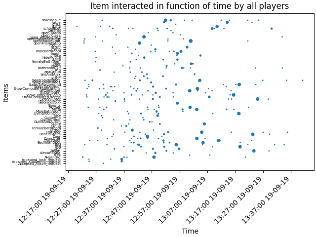

### xAPISG-ItemsActionTypeInteracted

Displays a multiple bar chart showing, for each action type (e.g. `talk_to`), the total number of times the player has interacted with it.

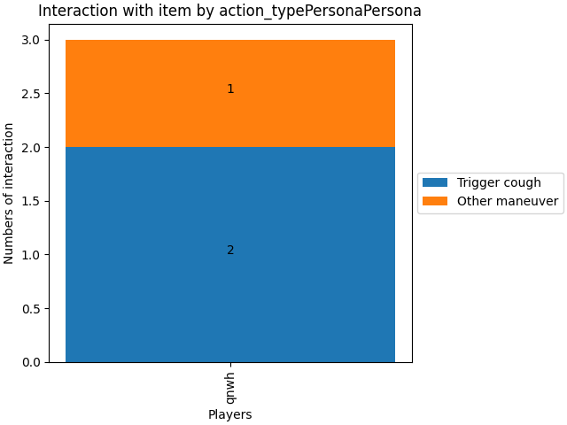

### xAPISG-AccessedAccessible

For each accessible, a bar-chart displaying, for that accessible, the number of times that each player accessed it.

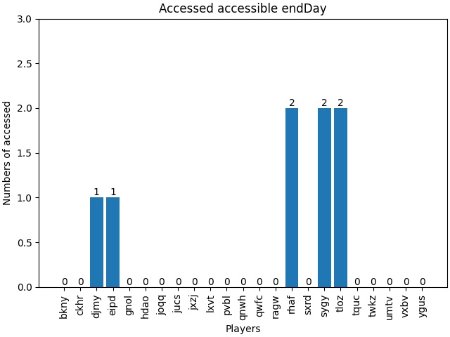

A heatmap showing how many times each player accessed each accessible.

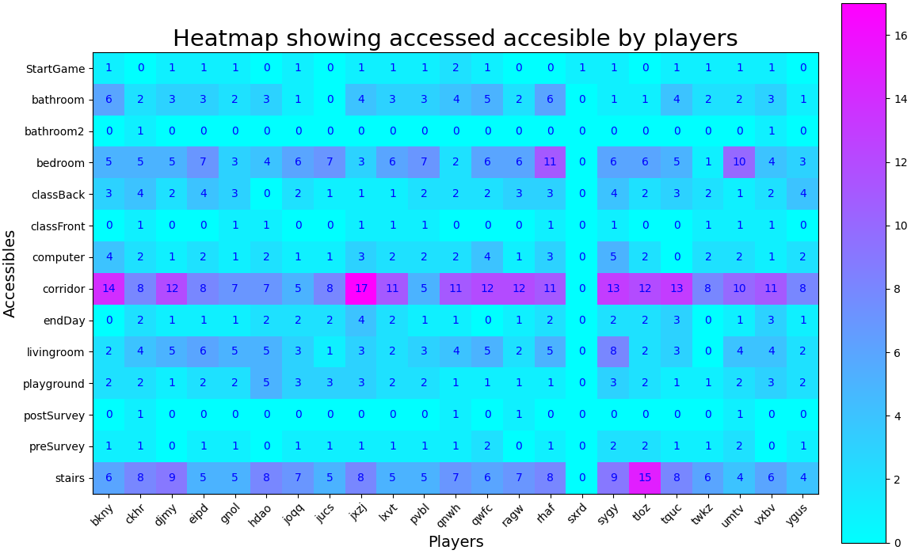

Also, a bubble chart displaying access to each accessible as a function of time. Larger bubbles indicate more players accessing an accessible at that time-period.

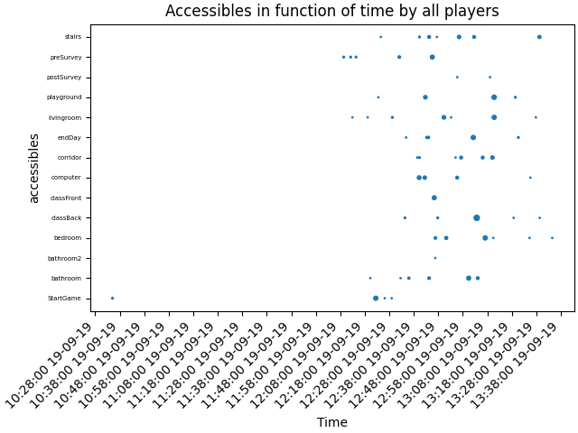
    
### xAPISG-MenusSelected

For each selection-menu, a bar-chart displaying, for that menu, the number of times that each player selected each option.


